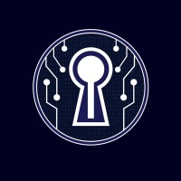

  

<h3 align="center">EX Machina - CTF</h3>
<h2>Created by: DOOM Agent Division</h2>

Our project integrates a Multi-Agent System (MAS) capable of autonomously generating exploits for security vulnerabilities. By fine-tuning the agents, we've developed a robust framework for identifying and exploiting common web application vulnerabilities such as:

SSRF (Server-Side Request Forgery)
XXE (XML External Entity Injection)
This autonomous system is designed to assist in vulnerability research and educational purposes, showcasing the power of agent-driven cybersecurity automation.

